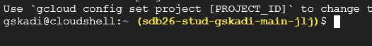

# X0 Google Cloud

- [X0 Google Cloud](#x0-google-cloud)
  - [Durchführung](#durchführung)
    - [1. Google Cloud Console öffnen](#1-google-cloud-console-öffnen)
    - [2. Service Account erstellen](#2-service-account-erstellen)
    - [3. Bucket erstellen](#3-bucket-erstellen)
    - [4. Ordner erstellen und Datei hochladen](#4-ordner-erstellen-und-datei-hochladen)
    - [5. Berechtigungen des Buckets prüfen](#5-berechtigungen-des-buckets-prüfen)
    - [6. Aktivierung von Cloud Shell](#6-aktivierung-von-cloud-shell)
    - [7. Bucket-Objekt herunterladen](#7-bucket-objekt-herunterladen)
    - [8. Objekt mit dem Service Account herunterladen](#8-objekt-mit-dem-service-account-herunterladen)
      - [8.1 Zum Service Account werden](#81-zum-service-account-werden)
      - [8.2 Identität des Service Accounts bestätigen](#82-identität-des-service-accounts-bestätigen)
      - [8.3 Objekt als Service Account downloaden](#83-objekt-als-service-account-downloaden)
    - [8.4 Berechtigungen für den Service Account vergeben](#84-berechtigungen-für-den-service-account-vergeben)
      - [8.5 Objekt erfolgreich als Service Account downloaden](#85-objekt-erfolgreich-als-service-account-downloaden)
      - [8.6 Berechtigungsgrenzen testen](#86-berechtigungsgrenzen-testen)
      - [8.7 Impersonation deaktivieren](#87-impersonation-deaktivieren)
    - [9. Vergleich: als du selbst löschen](#9-vergleich-als-du-selbst-löschen)
    - [10. Aufräumen](#10-aufräumen)
    - [Abschluss](#abschluss)

In diesem Lab machst du deine ersten Schritte in der **Google Cloud Console**. Anhand eines
kleinen Szenarios, einer Datei in einem Cloud Storage Bucket, auf die ein **Service Account**
zugreifen soll, lernst du die grundlegende Struktur von Google Cloud (Projekte, Ressourcen, IAM)
sowie die Bedienung der Web Console kennen. Dabei siehst du am eigenen Beispiel, dass Berechtigungen
in der Cloud **granular pro Identität** vergeben werden müssen und nichts automatisch "mitgilt" -
ein zentrales Prinzip von Security by Design.

> [!NOTE]
> Für dieses Lab benötigst du Zugang zu einem Google-Cloud-Projekt, das von deinem Kursleiter
> bereitgestellt wurde. Es ist kein eigener Google Cloud Account und kein lokales Setup nötig -
> alle Schritte werden ausschließlich im Browser über die Google Cloud Console durchgeführt.

## Durchführung

Die folgenden Schritte gehen davon aus, dass du bereits Zugangsdaten zu einem Google-Cloud-Projekt
von deinem Kursleiter erhalten hast.

### 1. Google Cloud Console öffnen

Öffne im Browser [console.cloud.google.com](https://console.cloud.google.com) und melde dich mit
den bereitgestellten Zugangsdaten an.

Prüfe oben links über den Projekt-Umschalter (Project Picker), dass das von deinem Kursleiter
genannte Projekt ausgewählt ist. Falls nicht, wähle es dort aus.
Eventuell musst du über das Drop-down-Menü oben links im Pop-up eine **Organisation** auswählen, um das Projekt zu sehen.

> [!NOTE]
> Ein Google Cloud **Projekt** ist die grundlegende Einheit, in der Ressourcen (Buckets,
> Service Accounts, VMs, ...) organisiert werden. Rechte werden typischerweise auf
> Projektebene oder direkt auf einzelnen Ressourcen vergeben - genau das schauen wir uns
> in diesem Lab genauer an.
>
### 2. Service Account erstellen

Zunächst erstellen wir eine weitere Identität, um Unterschiede in den Berechtigungen besser darstellen zu können.
Navigiere über das Hamburger-Menü oben links zu **IAM and admin → Service Accounts**
und klicke auf **Create Service Accounts**.

1. Vergib einen Namen, z. B. `lab-reader`, und klicke auf **Create and continue**.
2. Überspringe die Schritte **Permissions** und **Principals with Access**, indem du direkt auf **Create and close** klickst.
3. Klicke nun auf den frisch erstellten **Service Account**.
4. Wähle den Tab **Principals with access**.
5. Klicke auf **Grant access** und trage deine eigene E-Mail-Adresse (die deines Google-Cloud-Kontos) als **New principals** ein.
6. Wähle unter **Assign Roles** die Rolle **Service Account Token Creator** aus.
7. Klicke dann auf **Save** und prüfe in der Liste, ob die Berechtigungen für dich übernommen wurden.

Der neue Service Account hat nun eine E-Mail-Adresse in der Form
`lab-reader@<projekt-id>.iam.gserviceaccount.com`. Notiere dir diese, da wir sie später benötigen.

> [!NOTE]
> Ein **Service Account** ist eine Identität für Anwendungen/Workloads statt für Menschen. Dieser wird
> genutzt, wenn ein Skript, ein Server oder eine CI/CD-Pipeline (statt eines Menschen) auf
> Google-Cloud-Ressourcen zugreifen soll. Andere Cloud-Plattformen nennen sie unterschiedlich,
> doch das Konzept technischer Benutzer sollte aus vielen anderen Umgebungen bekannt sein.
>
### 3. Bucket erstellen

Nun erstellen wir eine einfache Ressource.
Navigiere über das Menü links (Hamburger-Icon) zu **Cloud Storage → Buckets** und klicke auf
**Erstellen** (Create).

1. Gib ganz oben einen eindeutigen Namen ein (Bucket-Namen sind **global** eindeutig -
   ergänze z.B. deine Initialen oder eine Zufallszahl, z.B. `sbd-lab-<eindeutiger name>`)
   und klicke auf **Continue**.
2. Wähle bei **Where to Store your Data** die Kategorie **Region** aus und bei **Standort** (Location)
  eine Region in Europa (Data Residency!). Versuche, eine zu verwenden, die möglichst nah an deinem Standort liegt. Das minimiert in produktiven Szenarien die Latenz. Die konkrete Auswahl ist für dieses Lab nicht wichtig. Klicke anschließend auf **Continue**.
3. Lass bei **How to Store your Data** die Option **Set a default class** sowie **Standard** ausgewählt.
  Lass die anderen Optionen auf ihren Standardwerten und klicke auf **Continue**.
4. Aktiviere im Abschnitt **How to Control Access to Objects** die Option
  **Enforce Public Access Prevention**. Die IP-Filterung kannst du überspringen. Klicke auf **Continue**.
5. Übernimm im Abschnitt **How to Protect Object Data** die Standardwerte und klicke ganz unten
   auf **Create**.

### 4. Ordner erstellen und Datei hochladen

1. Öffne den gerade erstellten Bucket und klicke mittig auf **Create Folder** (z. B. mit dem Namen `daten`).
2. Erstelle lokal auf deinem Rechner eine kleine JSON-Datei, z. B. `geheim.json`, mit folgendem Inhalt:

   ```json
   {
     "lab": "google-cloud",
     "hinweis": "Dieses Objekt sollte nur mit expliziter Berechtigung lesbar sein."
   }
   ```

3. Öffne den Ordner `daten` und lade die Datei über **Upload → Upload Files** in den Bucket hoch.

### 5. Berechtigungen des Buckets prüfen

Wechsle im Bucket zum Tab **Permissions**.

Sieh dir an, welche Principals (Nutzer, Gruppen, Service Accounts) hier aktuell Zugriff haben.
Vermutlich siehst du nur Rollen, die **vom Projekt geerbt** sind (siehe Spalte **Inheritance**).

Diese Tabellen sind der Kern von IAM in Google Cloud (und sehr ähnlich in anderen Cloud-Plattformen):
Zugriff wird **pro Identität** (Nutzer, Service Account, Gruppe) und **pro Ressource oder Projekt** vergeben.
Eine neue Identität hat standardmäßig **keinerlei Zugriff**, bis ihr explizit eine Rolle zugewiesen wird.

> [!NOTE]
> Die Einträge der Principals `Editors of project ...` und ähnliche entstehen automatisch aus den geerbten
> Berechtigungen darüber und darunter. Google Storage hat diese aus Kompatibilitätsgründen. Für uns sind sie
> nicht weiter wichtig.

### 6. Aktivierung von Cloud Shell

Klicke oben rechts in der Console auf das **Cloud Shell**-Symbol (`>_`) und warte, bis die Shell
bereitgestellt wurde. Bestätige die Autorisierungsabfrage, damit Cloud Shell deine Identität nutzen kann.

Cloud Shell stellt dir eine temporäre, kleine VM mit vorinstallierten Tools (u. a. `gcloud`)
bereit, direkt im Browser. Standardmäßig ist sie mit **deiner eigenen** Nutzeridentität
angemeldet.



Hier siehst du eine Linux-CLI und in Gelb das aktuell ausgewählte Projekt (dein eigenes).
Alle Kommandos beziehen sich automatisch auf dieses Projekt, falls nicht anders angegeben -
das spart uns später etwas Tipparbeit.

### 7. Bucket-Objekt herunterladen

Versuchen wir nun, mit dem `gcloud`-Tool die Datei aus dem Bucket abzurufen.
Führe dazu das folgende Kommando in der Cloud Shell aus:

```bash
gcloud storage cp gs://<dein-bucket-name>/daten/geheim.json .
cat geheim.json
```

Der Download sollte nach kurzer Zeit erfolgreich abschließen.
Dieser Download hat deine eigene Identität genutzt, die als Eigentümer des Buckets
selbstverständlich Zugriff auf die Datei hat.

### 8. Objekt mit dem Service Account herunterladen

#### 8.1 Zum Service Account werden

Nun werden wir als Service Account handeln, den wir gerade erstellt haben.
Hierzu werden wir **Impersonation** nutzen, d. h. wir werden unsere Berechtigungen als
**Benutzer** des Service Accounts nutzen, um in seinem Namen Aktionen durchzuführen.

Dazu konfigurieren wir `gcloud` mit dem folgenden Kommando (ersetze die E-Mail-Adresse durch deinen zuvor erstellten Account):

```bash
gcloud config set auth/impersonate_service_account lab-reader@<projekt-id>.iam.gserviceaccount.com
```

Dieser Befehl bewirkt, dass `gcloud` ab sofort **vor jedem** folgenden Befehl zunächst die
Identität des angegebenen Service Accounts annimmt und den Befehl dann **in dessen Namen** ausführt -
so lange, bis du die Impersonation wieder deaktivierst.

Damit wir das tun können, haben wir uns selbst zuvor die Rolle **Service Account Token Creator** für den Account zugewiesen. Das erlaubt uns, ein **Access-Token** für den Account zu bekommen - ansonsten würde die Impersonation fehlschlagen.

> [!TIP]
> `gcloud`-Befehle akzeptieren auch das Flag `--impersonate-service-account=...`,
> um die Impersonation nur für diesen einen Befehl zu nutzen.

#### 8.2 Identität des Service Accounts bestätigen

Frage Google Cloud, welche Identität aktuell tatsächlich für Anfragen verwendet wird.
Dabei hilft der `/tokeninfo`-Endpunkt, der uns die Identität des Aufrufers verrät.

Nutze dafür folgendes Kommando:

```bash
curl -s "https://oauth2.googleapis.com/tokeninfo?access_token=$(gcloud auth print-access-token)"
```

Im Feld `email` der Ausgabe siehst du `lab-reader@<projekt-id>.iam.gserviceaccount.com` - du
handelst jetzt tatsächlich als Service Account, nicht mehr als dein persönlicher Account.

#### 8.3 Objekt als Service Account downloaden

Führe den Download-Befehl von vorher noch einmal aus. Mit *Pfeiltaste-Hoch* kommst du schnell zu vorherigen Eingaben.

```bash
gcloud storage cp gs://<dein-bucket-name>/daten/geheim.json .
cat geheim.json
```

Dieses Kommando **wird mit `reason: IAM_PERMISSION_DENIED` fehlschlagen**. Wir sehen also,
dass der Service Account im Gegensatz zum persönlichen Account keine Berechtigungen hat, um den Bucket zu lesen.

### 8.4 Berechtigungen für den Service Account vergeben

Kehre zu deinem Bucket zurück, öffne wieder den Tab **Permissions** und klicke auf
**Grant Access**.

1. Trage als neuen Principal die E-Mail-Adresse deines Service Accounts ein.
2. Weise die Rolle **Storage Object Viewer** zu.
3. Klicke **Save** und stelle sicher, dass der Service Account jetzt in der Liste mit seiner Rolle auftaucht.

> [!NOTE]
> Beachte, wie gezielt diese Rolle ist: Der Service Account darf nun **Objekte lesen**, aber z.B.
> keine Objekte löschen, keine neuen Buckets erstellen oder Berechtigungen ändern. Das ist das
> Prinzip der **geringsten Rechte** (Least Privilege) in der Praxis.

#### 8.5 Objekt erfolgreich als Service Account downloaden

Führe den Download-Befehl aus Schritt 9.3 erneut aus. Die Impersonation wird erneut genutzt
und diesmal sollte der Download des Objekts erfolgreich sein.

```bash
gcloud storage cp gs://<dein-bucket-name>/daten/geheim.json .
cat geheim.json
```

> [!WARNING]
> Wenn du sehr schnell bist, könntest du einen weiteren Fehler bekommen.
> Berechtigungsänderungen sind **eventually consistent**, d.h. sie benötigen evtl. ein paar Momente,
> um global propagiert und wirksam zu werden. Probiere es ggf. einfach kurz danach erneut.
> Länger als 2 Minuten sollte es allerdings nicht dauern.

#### 8.6 Berechtigungsgrenzen testen

Probiere diesen Befehl aus, **der fehlschlagen wird**, da der Service Account keine Berechtigungen hat,
um das Objekt zu löschen.

```bash
# Dieser Befehl wird fehlschlagen
gcloud storage rm gs://<dein-bucket-name>/daten/geheim.json
```

#### 8.7 Impersonation deaktivieren

Schalte die Impersonation danach wieder aus, um in Cloud Shell wieder als du selbst zu handeln
und überprüfe dies mit dem `/tokeninfo`-Endpunkt.

```bash
gcloud config unset auth/impersonate_service_account
curl -s "https://oauth2.googleapis.com/tokeninfo?access_token=$(gcloud auth print-access-token)"
```

### 9. Vergleich: als du selbst löschen

Wiederhole jetzt den Befehl zum Löschen des Objekts - er läuft nun wieder als dein persönlicher Account:

```bash
gcloud storage rm gs://<dein-bucket-name>/daten/geheim.json
```

Da dein persönlicher Account der Eigentümer des Buckets ist, funktioniert die Löschung problemlos.

### 10. Aufräumen

Räume die erstellten Ressourcen wieder auf:

1. Lösche in **IAM & Verwaltung → Service Accounts** den Service Account `lab-reader`.
2. Lösche in **Cloud Storage → Buckets** deinen erstellten Bucket (inkl. Inhalt).

Alternativ kannst du diese Kommandos in der Cloud Shell nutzen:

```bash
# Löscht alle Dateien im Bucket und dann den Bucket selbst
gcloud storage rm -r gs://<dein-bucket-name>
# Löscht den Service Account - bestätige bei Aufforderung mit "Y"
gcloud iam service-accounts delete <service-account-email>
```

### Abschluss

In diesem Lab hast du dich zum ersten Mal durch die Google Cloud Console bewegt und dabei
Folgendes gelernt:

- Navigation durch die Google Cloud Console: Projekte, Cloud Storage Buckets, Service Accounts
  und Cloud Shell.
- Berechtigungen in der Cloud gelten **pro Identität und Ressource** - eine Identität hat
  standardmäßig nichts, und selbst kleine Aufgaben (ein Objekt lesen) erfordern eine gezielte,
  geprüfte Rechtevergabe.
- Für den Zugriff auf einen Service Account brauchten wir kein Passwort: Mit **Impersonation** und
  einem Caller-Identity-Check hast du nachvollzogen, als welche Identität `gcloud` gerade tatsächlich handelt.
- Viele Sicherheits-Features wie **Public Access Prevention**, **regionale Replikation** oder
  **explizite Berechtigungen** stehen bei Cloud-Plattformen zur Verfügung - sie zu kennen und konsistent sinnvoll
  zu nutzen ist die Herausforderung.
